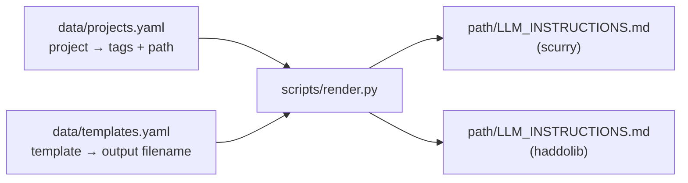

# stencil

**A tiny templating engine that keeps generated per-project artefacts in sync across an independent fleet of repos.**

*Stencil* (noun) -- a template through which the same shape is repeatably applied to many surfaces, each surface still showing through in its own way.

---

## Vision

`stencil` exists to solve one problem: a growing personal fleet of independent repos each need their own `LLM_INSTRUCTIONS.md` (and, soon, other generated artefacts), and hand-editing each one drifts them apart over time. `stencil` renders each project's artefact from one shared Jinja2 template, differentiated per project by a flat set of `dimension:value` tags -- not by forking the template or writing project-specific logic.

**Core philosophy:**

- **Tag-driven, not project-driven.** The template branches on tags (`technology:python`, `project:scurry`, ...), never on a project's identity directly. Onboarding a new project is a `data/projects.yaml` entry, not a template change.
- **Uniform until proven otherwise.** Every template in `data/templates.yaml` applies to every project. A tag-gated `requires:` mechanism was designed but deliberately not built -- there's no real case for it yet, and adding it later doesn't require touching anything else.
- **Fail loud, not partial.** A render run either fully succeeds or writes nothing at all. A single project with a missing output path aborts the whole run rather than leaving some projects updated and others stale.
- **Small on purpose.** Two data files and one script. `stencil` is deliberately smaller in scope than its sibling projects (`scurry`, `haddolib`) -- there is no PyXLL bridge, no database, no GUI: just tags in, rendered text out.

---

## Architecture



### The pure/IO split

`render_project(tags: list[str], template_str: str) -> str` is the entire rendering logic, and it is pure -- no file I/O, no knowledge of `projects.yaml` or the filesystem. It's the same function the whitespace-quirk test suite exercises directly. `main()` is orchestration only: load the two YAML files, resolve which project(s) to render (`--project NAME`, or every project if omitted), and write the results.

### Two-phase, fail-loud rendering

`main()` never mixes validation and writing. Phase 1 checks that every target project's `path:` exists as a directory *before* anything is rendered; if even one is missing, the run aborts with an error listing every problem found, and **nothing is written** -- not even for the projects whose paths were fine. Phase 2 only runs once every path in the batch has been confirmed. This trades a small amount of up-front work for the guarantee that a fleet-wide `make render` can never leave some repos updated and others silently stale.

---

## Current status

- **Data:** `data/projects.yaml` holds two projects so far (`scurry`, `haddolib`), each with its `tags:` and a `path:`. Both currently point at scratch `tmp/` locations rather than their real sibling-repo paths -- switching to real paths is an open TODO, not a blocker.
- **Templates:** `data/templates.yaml` currently lists two artefact type, `data/LLM_INSTRUCTIONS.md.j2` → `LLM_INSTRUCTIONS.md`, `data/CRITICAL_RULES.md.j2` → `CRITICAL_RULES.md` and `data/FIRST_PROMPT.md.j2` → `FIRST_PROMPT.md`. More entries are expected; the schema doesn't need to change to add them.
- **Rendering:** `scripts/render.py` is built, wired into `make render` (optionally `make render PROJECT=name`), and verified end-to-end against the real template and real tag data.
- **Tests:** 10 tests green, covering four whitespace-handling shapes against small invented fixtures (see below). A golden-file test -- rendering the actual `LLM_INSTRUCTIONS.md.j2` against `project:scurry` + `technology:applescript`, checked in by hand -- is planned but not yet built.

---

## Settled decisions

- **`history:` names the changelog-file dimension, not `components:`.** Most fleet projects keep a `HISTORY.md`; a few keep a `CHANGELOG.md`. `history:history` / `history:changelog` says exactly what varies; `components:` was a leftover name that didn't describe anything.
- **`status:` is a deliberate, currently-inert tag.** It exists to prove that a declared-but-unused tag flows through the pipeline harmlessly, ahead of the template actually branching on it.
- **`requires:` tag-gating for `templates.yaml` is designed, not built.** Every template applies to every project today. If a future template should only apply to a subset of projects, an optional `requires: dimension:value` field per template entry is the planned extension -- deferred because there's no real case for it yet.
- **`--project NAME` was added from the start,** even with only two fleet projects, because projects are being onboarded one at a time and re-rendering the whole fleet on every small change would be unnecessary friction.
- **`tmp/` output paths are scratch, not final,** and `make clean` deletes them along with the venv and pytest cache -- accepted, not a bug.
- **Tags are a flat, namespaced list, not nested YAML.** `dimension:value` strings in one list per project -- cheap to write, cheap to grep, no per-dimension sub-schema to maintain.
- **One combined `data/projects.yaml`, one top-level key per project** -- not one YAML file per project. Chosen for eyeball-ability at this fleet size (currently a handful of projects).
- **Omit a tag rather than marking it `dimension:none`** when a dimension doesn't apply to a project. Absence is the "not applicable" signal; there's no reserved `none` value to keep in sync.

---

## Tagging principles

Guidance for whoever next edits `LLM_INSTRUCTIONS.md.j2` (or a future template) -- established the hard way, worth reading before adding a new conditional block rather than rediscovering by trial and error.

- **Tag content by what it's actually about, not by which section it happens to sit in.** For example, the "Error Handling" section's AppleScript-specific example is tagged `project:scurry` -- it's about scurry's mail-exporter domain -- not `technology:applescript`, which would wrongly imply every AppleScript project shares that example.
- **Don't split a tag preemptively for a hypothetical second instance.** A block can stay under one blanket `project:scurry` wrap even where some of its content is arguably "AppleScript in general," until a second AppleScript project actually exists to justify the split. A structural distinction whose real population is one belongs in a note, not a second tag.
- **Plain `` blocks, not `` chains** -- even where a chain would be shorter -- because independent `if` blocks don't assume mutual exclusivity, which stays the safer default as the fleet grows and tag combinations multiply.

---

## Running and testing

```bash
make setup                    # create venv, install dependencies
make render                   # render every project
make render PROJECT=scurry    # render just one
make test                     # run the test suite (quiet)
make test-verbose             # run the test suite (verbose)
make clean                    # remove venv, caches, and tmp/ (incl. rendered output)
```

### What the tests actually cover

`tests/test_render_whitespace.py` exercises `render_project` directly against four small, invented `.j2` fixtures in `tests/fixtures/` -- deliberately abstract (`demo:on`, `demo:alpha`, ...) rather than snippets of the real template, so the tests stay decoupled from unrelated prose changes elsewhere:

- **`leading_dash_trim.j2`** -- a `...` block on its own lines; both tag-present and tag-absent branches checked.
- **`inline_conditional.j2`** -- an `......` sitting entirely inline on one line; no trimming needed at all, which is itself the useful fact this fixture documents.
- **`adjacent_independent_ifs.j2`** -- two separate dash-trimmed blocks back-to-back with no shared ``; all four tag combinations checked.
- **`trailing_dash_trim.j2`** -- the mirror image of the first fixture: `...`, trimming forward instead of backward.

Planned next: one golden-file test rendering the real `LLM_INSTRUCTIONS.md.j2` against a real tag combination (`project:scurry` + `technology:applescript`), checked in by hand and updated only by deliberate re-approval -- never auto-regenerated.

---

## Technical notes & gotchas

- **Leading-dash (``) trims backward** -- it eats the newline *before* the tag. Use it when the tag sits on its own line inside a block of otherwise-fixed content, so removing the block doesn't leave a blank line behind.
- **Trailing-dash (``) trims forward** -- it eats the newline *after* the tag, the mirror case. Same effect, opposite direction.
- **Inline conditionals need no dash at all.** When the whole `...` sits on one line with real content around it, there's no template-tag-only line to produce stray whitespace in the first place -- dash-trimming solves a problem that inline conditionals don't have.
- **Adjacent independent blocks compose cleanly** as long as each carries its own dash-trim at its own boundary -- one block's trimming doesn't interfere with its neighbor's, in any combination of which tags are present.
- **Verify quirks by actually rendering, not by reading the template.** Every fixture case above was confirmed by running it through Jinja2 and inspecting the literal output -- whitespace behavior at a glance is not a reliable substitute for actual output.
